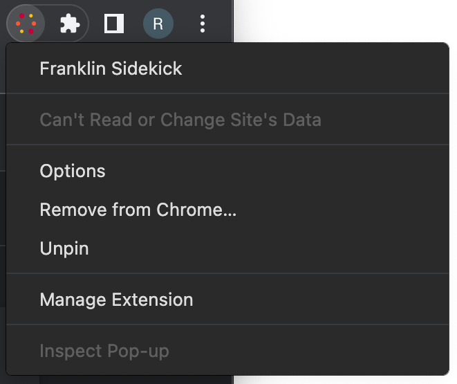

# Helix Sidekick

> Browser helper for authoring Helix projects

## Status
[](https://codecov.io/gh/adobe/helix-sidekick)
[](https://circleci.com/gh/adobe/helix-sidekick)
[](https://github.com/adobe/helix-sidekick/blob/master/LICENSE.txt)
[](https://github.com/adobe/helix-sidekick/issues)
[](https://lgtm.com/projects/g/adobe/helix-sidekick)
[](https://github.com/semantic-release/semantic-release)

## Installation

### Bookmarklet

1. Navigate to https://www.hlx.live/tools/sidekick/ and read the instructions.

### Extension (experimental)

The bookmarklet configures the Sidekick for a single project and needs to be reopened in every new browser tab. Use the browser extension to:
- keep the Sidekick open (or closed) while reloading or navigating multiple browser tabs
- configure Sidekick for multiple projects without cluttering your browser's bookmark bar

#### Test-driving the Chrome Extension
1. Clone this repository to your local disk: `git clone https://github.com/adobe/helix-sidekick.git`
   1. Alternatively, you could also download the latest release as ZIP file from [here](https://github.com/adobe/helix-sidekick/releases)
1. Open Chrome and navigate to `chrome://extensions`
1. Turn on _Developer mode_ at the top right of the header bar<br />

1. Click the _Load unpacked_ button in the action bar<br />

1. Navigate to the `src > extension` folder of your local `helix-sidekick` copy and click _Select_ to install and activate the Sidekick extension.
1. Verify that your _Extensions_ page displays a box like this:<br />
<br />
1. Click the extensions ("puzzle piece") icon next to Chrome's address bar to see a list of all extensions. Verify that there's a grayed out Helix icon like this:<br />
<br />
Click the pin button next to it to make sure it is always visible.
1. Now click the Helix icon and select _Options_:<br />
<br />
On this page, you can add Helix projects by either pasting a share URL* or a GitHub URL in the respective fields and clicking _Add_. This page will also allow you to view, edit and delete existing projects.
   1. Alternatively, you can also navigate to a share URL* where the Sidekick extension will ask you if you wish to add the project. Click OK to add.
1. Navigate to your project's homepage and click on the (now colored) Helix icon to toggle the Sidekick.

\* Share URLs start with `https://www.hlx.live/tools/sidekick/...`

## Configuration

Helix Sidekick supports a number of (optional) configuration options developers can add to the project to maximize the Sidekick experience:
https://www.hlx.live/tools/sidekick/config.html

## Usage

See the [API documentation](docs/API.md).

## Development

### Build

```bash
$ npm install
```

### Test

```bash
$ npm test
```

### Lint

```bash
$ npm run lint
```

### Local testing

You can leverage Helix CLI for local testing. If you haven't already installed it, run: `npm i -g @adobe/helix-cli`

#### Test a local Sidekick version

1. Run `npm run debug` on your local checkout of this repository
2. Install a Sidekick bookmarklet for your project: https://www.hlx.live/tools/sidekick/
3. Edit the bookmarklet URL by replacing `https://www.live/tools/sidekick/app.js` with `http://localhost:3000/src/sidekick/app.js`
4. Click the bookmarklet to launch your local version

#### Test a local project config

If you want to test a [config](#configuration) file before deploying it to your project:
1. Run `npm run debug` on your local checkout of the project repository
2. Install a Sidekick bookmarklet for your project: https://www.hlx.live/tools/sidekick/
3. Edit the bookmarklet URL by appending `,"devMode":"true"` after `"ref":"*"` (`*` being your project branch)
4. Click the bookmarklet to launch Sidekick using your local config

## Deployment

The Helix Sidekick gets deployed to https://www.hlx.live/tools/sidekick/. The corresponding repository is https://github.com/adobe/helix-website. Deployment is fully automated.

### Testing a development version

Every development branch in this repository will be mirrored in https://github.com/adobe/helix-website with a `sidekick-` prefix. This enables branch testing:

1. Push changes to a branch `issue-77`
2. Note the `sidekick-issue-77` branch in https://github.com/adobe/helix-website/branches
3. Go to `https://sidekick-issue-77--helix-website--adobe.hlx.page/tools/sidekick/` to install a development version for your project

_Note: Mirrored development branches in https://github.com/adobe/helix-website/branches must be deleted manually when no longer needed._

### Releasing a new version

Once a branch is merged to `main` in this repository, a PR will automatically be opened in https://github.com/adobe/helix-website for final review of the release candidate (RC):

1. Merge your branch to `main`
2. Go to the _Sidekick Release Candidate_ PR in https://github.com/adobe/helix-website/pulls
3. Pick reviewer(s) and wait for approval(s)
4. The PR is based on a `sidekick-rc-*` branch (`*` being a random ID) so the RC can also be tested:
   `https://sidekick-rc-*--helix-website--adobe.hlx.page/tools/sidekick/`
5. Once approved, the PR can be merged to deploy the new version into production
