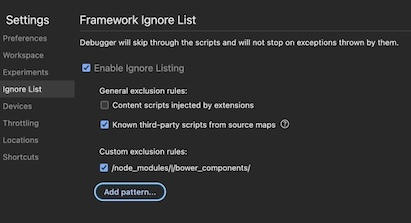

# AEM Sidekick Extension

> Browser extension for authoring AEM sites

## Status
[](https://codecov.io/gh/adobe/helix-sidekick-extension)
[](https://circleci.com/gh/adobe/helix-sidekick-extension)
[](https://github.com/adobe/helix-sidekick-extension/blob/master/LICENSE.txt)
[](https://github.com/adobe/helix-sidekick-extension/issues)
[](https://lgtm.com/projects/g/adobe/helix-sidekick-extension)
[](https://github.com/semantic-release/semantic-release)

## Installation

#### Installing the Chrome extension
1. Go to the [Chrome Web Store](https://chrome.google.com/webstore/detail/helix-sidekick-extension-beta/ccfggkjabjahcjoljmgmklhpaccedipo)
1. Click _Add to Chrome_
1. Confirm by clicking _Add extension_
1. Click the extensions icon next to Chrome's address bar to see a list of all extensions:<br />

1. Verify that there's an icon like this:<br />
<br />
1. Click the pin button next to it to make sure it always stays visible.

##### Adding projects to the Chrome extension
1. Right-click the extension's icon and select _Options_:<br />
<br />
On this page, you can add projects by either pasting a share URL* or a GitHub URL in the respective fields and clicking _Add_. This page will also allow you to view, edit and delete existing projects.
   1. Alternatively, you can also navigate to a share URL* or a GitHub project, click the extension's icon and select _Add project_.
1. Navigate to your project's homepage and click on the extension's icon to toggle the Sidekick.

\* Share URLs start with `https://www.hlx.live/tools/sidekick/...`

## Usage
Refer to the [Sidekick documentation](https://www.hlx.live/docs/sidekick) to learn more about its features.

## Development

### Build

```bash
$ npm install
$ npm run build
```

### Test

```bash
$ npm test
```

### Lint

```bash
$ npm run lint
```

### Local testing

#### Testing a local Chrome extension
1. Run `npm run build:chrome`
1. Open Chrome and navigate to `chrome://extensions`
1. Turn on _Developer mode_ at the top right of the header bar<br />

1. Click the _Load unpacked_ button in the action bar<br />

1. Navigate to the `dist > chrome` folder and click _Select_ to install and activate the Sidekick extension.
1. Verify that your _Extensions_ page displays a box like this:<br />
<br />
1. Configurations are not automatically migrated to the Unpacked extension. Either follow the steps under [Adding projects to the extension](#adding-projects-to-the-extension) or Export/Import the other plugin's configuration.
1. If you do not see the Sidekick JavaScript files in the browser debug window, check that they are not being ignored. Ensure "Content scripts injected by extensions" is unchecked: <br />


#### Testing a local project config
If you want to test a config file before deploying it to your project:

1. Run `hlx up` on your local checkout of the project repository
1. [Add your project](#adding-projects-to-the-chrome-extension) to the sidekick extension
1. Enable local project configruation:
   1. Right-click the extension's icon and select _Options_
   1. Click _Advanced_ on the left
   1. Click _Edit_ on the project configuration you want to test locally
   1. Tick the _Test project configuration locally_ checkbox
   1. Click _Save_
1. Navigate to a project URL and activate the sidekick extension

## Deployment

### Deploying Chrome Extension

The Chrome extension is [automatically built and uploaded](https://github.com/adobe/helix-sidekick-extension/blob/main/.releaserc.cjs#L28) to Chrome Web Store every time a pull request triggering a `semantic-release` is merged into `main`. Once reviewed by Google, it will be auto-published and pushed to end users' browsers.

The following environment variables are required in the CircleCI project settings: `GOOGLE_APP_ID`, `GOOGLE_CLIENT_ID`, `GOOGLE_CLIENT_SECRET` and `GOOGLE_REFRESH_TOKEN`. See [here](https://circleci.com/blog/continuously-deploy-a-chrome-extension/) for detailed instructions how to obtain and generate them.

#### Chrome Developer Dashboard (Adobe only)
As an Adobe developer, see https://wiki.corp.adobe.com/x/xJlMqQ for instructions how to get access to the Chrome Developer Dashboard and make changes to the Chrome Web Store listing.

### Safari Extension

The Safari Extension is built, signed and uploaded to App Store Connect automatically each time a pull request triggering a `semantic-release` is merged into `main`.

An Xcode Cloud workflow is listening for changes made to the [change log file](./CHANGELOG.md) in the `main` branch.
#### App Store Connect (Adobe only)
As an Adobe developer, see https://wiki.corp.adobe.com/x/xJlMqQ for instructions how to get access to the App Store Connect and make new builds available via TestFlight and public release.
